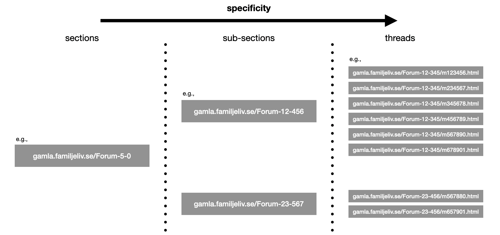

```{r, include = FALSE}
knitr::opts_chunk$set(
  collapse = TRUE,
  comment = "#>"
)
```

```{r setup}
library(familjelivscrapR)
```

# Introduction

This vignette's goal is to enable you to use `familjelivscrapR` in a meaningful way. In order to achieve this, its functionality and the rationale behind it are to be described. First, a brief overview of the structure of <gamla.familjeliv.se> is given. Please note that familjeliv.se and gamla.familjeliv.se are identical in their structure and content, but not in their "scrapability" -- familjeliv.se, for instance, limits the number of thread pages you can go back in time to 100 -- gamla.familjeliv.se doesn't. Second, the functions of `familjelivscrapR` are described. Third, examples are provided which show how to use it. 

## The structure of gamla.familjeliv.se

Figure 1 depicts the structure of www.familjeliv.se.



It is extremely simple: there are sections which contain threads. In theory, sections are clustered as well, but in practice, no list can be obtained -- hence, this can be ignored.

## The functions

A tibble containing the main sections' names and urls can be obtained using `get_sections()`.     
`get_threads` returns the threads within one section. The function takes needs at least one argument: the section's suffix (e.g., "/Forum-19-89/"). The arguments `thread_start_date` and `latest_entry` can be used to specify the search. The former corresponds to when the thread was started, the latter to the time point at which the latest posting was added to the thread. Their need to be entered as chaeracter strings, formatted like "YYYY-MM-DD". 
`scrape_threads()` then returns a thread's content. It takes two arguments. `suffix` is the suffix of the thread to be scraped (e.g., "Forum-27-260/m49908859.html"). There is also a rudimentary feature to remove quotes in the postings (e.g., so there is no double-counting). It is deactivated by default. However, it can be activated by setting `quotes = TRUE`.
